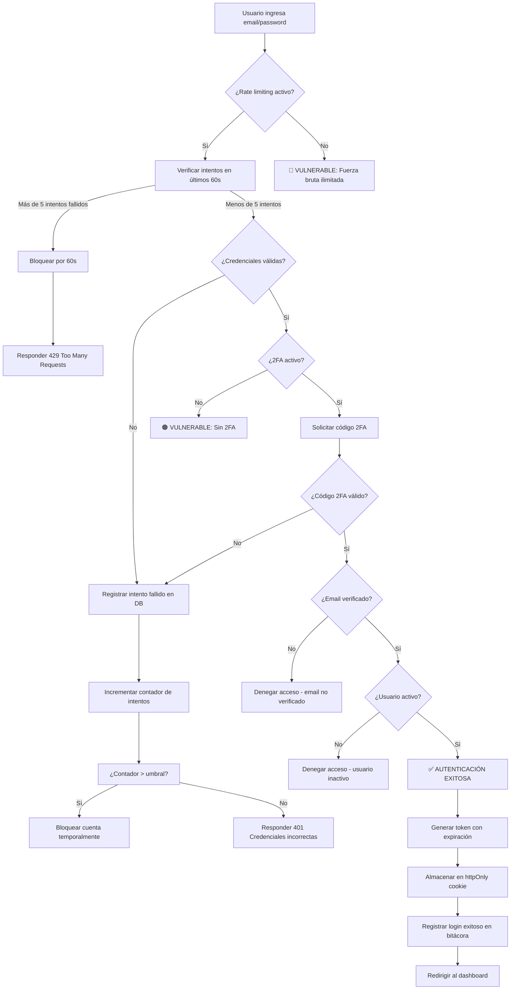
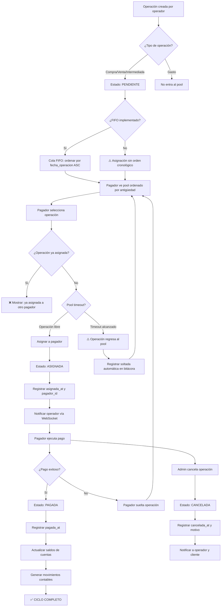
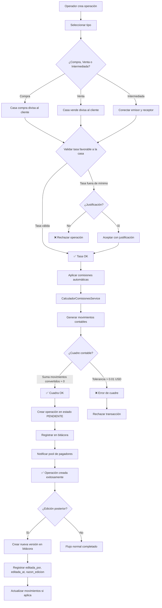

# INFORME EJECUTIVO DE AUDITORÍA DE SEGURIDAD Y CALIDAD

## INTERMEDIUS — Sistema Administrativo para Casa de Cambio

| Campo | Valor |
|---|---|
| **Versión del documento** | 1.0 |
| **Fecha de emisión** | Julio 2026 |
| **Clasificación** | CONFIDENCIAL |
| **Auditado por** | CTO / Arquitecto de Software / Equipo Azul de Ciberseguridad / QA |
| **Dirigido a** | CEO de Intermedius |

---

## ÍNDICE

1. [Resumen Ejecutivo](#1-resumen-ejecutivo)
2. [Matriz DOFA](#2-matriz-dofa)
3. [Observaciones Generales](#3-observaciones-generales)
4. [Puntos Vulnerables Detectados](#4-puntos-vulnerables-detectados)
5. [Puntos de Mejora Priorizados](#5-puntos-de-mejora-priorizados)
6. [Porcentaje de Avance por Módulo](#6-porcentaje-de-avance-por-módulo)
7. [Roadmap Recomendado](#7-roadmap-recomendado)
8. [Árboles de Decisión para Flujos Críticos](#8-árboles-de-decisión-para-flujos-críticos)
9. [Conclusión y Recomendaciones Finales](#9-conclusión-y-recomendaciones-finales)
10. [Anexos](#10-anexos)

---

# 1. RESÚMEN EJECUTIVO

## 1.1 Calificación General del Sistema

| Dimensión | Calificación | Interpretación |
|---|---|---|
| **Funcionalidad** | ⚠️ 68/100 | Núcleo contable sólido, pero falencias graves en FIFO, gastos y documentos |
| **Seguridad** | 🔴 32/100 | Múltiples vulnerabilidades críticas sin mitigar; exposición de credenciales en repositorio |
| **Calidad de código** | 🟡 55/100 | Arquitectura limpia en backend, pero sin tests, sin CI de calidad, deuda técnica acumulada |
| **Cobertura de pruebas** | 🔴 15/100 | ~73 tests backend, **cero tests frontend**, sin pruebas de seguridad ni rendimiento |
| **Cumplimiento normativo** | 🔴 10/100 | Sin AML/KYC, sin ISO 27001, sin políticas de privacidad |
| **Infraestructura** | 🟡 50/100 | CI/CD presente pero frágil; Docker para desarrollo no apto para producción |

**Puntaje general ponderado: 38/100 — CRÍTICO**

## 1.2 Hallazgos Críticos que Requieren Atención Inmediata

| # | Hallazgo | Impacto |
|---|---|---|
| **C-01** | Archivos `.env` con credenciales de producción commiteados al repositorio (DB_PASSWORD, APP_KEY, MAIL credenciales) | Exposición total de la base de datos, capacidad de desencriptar datos cifrados, compromiso del servidor de correo |
| **C-02** | Sin rate limiting en endpoint de login (`POST /api/v1/auth/login`) | Ataque de fuerza bruta ilimitado sobre credenciales de todos los usuarios |
| **C-03** | Tokens de Sanctum sin expiración (`expiration => null`) | Un token comprometido es válido indefinidamente; no hay mecanismo de revocación masiva |
| **C-04** | Sin autenticación de dos factores (2FA/MFA) | El único factor de autenticación es contraseña; sin 2FA, el riesgo de account takeover es máximo |
| **C-05** | Sin cifrado de datos sensibles en base de datos (teléfonos, emails, identificaciones de clientes en texto plano) | Incumplimiento de GDPR/LOPD; riesgo de exposición masiva de datos personales |
| **C-06** | Sin cumplimiento AML/KYC (sin verificación de identidad, sin reportes de operaciones sospechosas, sin umbrales) | **Riesgo legal existencial** para una casa de cambio en Venezuela; exposición a acciones regulatorias |
| **C-07** | Backups no documentados ni verificados | Pérdida total de datos en caso de desastre = cierre del negocio |

## 1.3 Tablero de Mando Ejecutivo

### Seguridad
| Indicador | Estado |
|---|---|
| Rate limiting en login | ❌ No implementado |
| 2FA/MFA | ❌ No implementado |
| Token expiration | ❌ No expira |
| CSP / HSTS / Security Headers | ❌ No implementados |
| Cifrado datos sensibles (PII) | ❌ No implementado |
| Logging de intentos fallidos | ❌ No implementado |
| APP_DEBUG=false en producción | ✅ Correcto |
| Bcrypt rounds = 12 | ✅ Correcto |
| Roles y permisos (Spatie) | ✅ Implementado |
| Políticas de acceso (Policies) | ✅ Parcialmente implementado |
| Soft deletes en entidades críticas | ✅ Implementado |

### Calidad
| Indicador | Estado |
|---|---|
| Tests backend | ⚠️ 73 tests (~15% cobertura) |
| Tests frontend | ❌ Cero |
| CI/CD con tests | ❌ No ejecuta tests en deploy |
| Static analysis | ❌ No implementado |
| Linting (PHP Pint) | ⚠️ Configurado pero no en CI |
| ESLint / Prettier (frontend) | ❌ No implementado |
| Pruebas de seguridad | ❌ No implementado |
| Pruebas de rendimiento | ❌ No implementado |

### Cumplimiento
| Indicador | Estado |
|---|---|
| ISO 27001 (controles esenciales) | ⚠️ ~25-30% |
| AML / UIF Venezuela | ❌ No implementado |
| KYC (Know Your Customer) | ❌ No implementado |
| Política de privacidad | ❌ No implementado |
| Términos y condiciones | ❌ No implementado |
| Consentimiento de datos | ❌ No implementado |

---

# 2. MATRIZ DOFA

## 2.1 Fortalezas (Internas)

| # | Fortaleza | Detalle |
|---|---|---|
| F1 | **Arquitectura contable sólida** | Ledger de partida doble con validación de cuadre (tolerancia 0.01 USD). Toda operación genera N movimientos. Garantiza integridad contable. |
| F2 | **Stack tecnológico moderno** | Laravel 11 + PHP 8.3 + Vue 3 + Vite + Pinia + TailwindCSS. Tecnologías vigentes con buen soporte. |
| F3 | **Modelo de roles y permisos granular** | Spatie Laravel Permission con 6 roles y políticas (Policies) por modelo. Control de acceso bien definido. |
| F4 | **Auditoría completa vía ActivityLog** | Todos los cambios en entidades críticas quedan registrados con causante, fecha y propiedades modificadas. |
| F5 | **Componentes frontend reutilizables** | CalculadoraBidireccional, ClienteSelector, CuentaSelector, AppPageHeader, etc. Buenos patrones de UI. |
| F6 | **Pipeline CI/CD funcional** | GitHub Actions con deploy automático a producción via SSH para backend y frontend. |
| F7 | **Soft delete en entidades críticas** | Clientes, cuentas, operaciones, usuarios con borrado lógico y papelera de recuperación. |
| F8 | **Auto-archivado de clientes inactivos** | Job programado que desactiva clientes sin operaciones tras 4 meses. Bueno para higiene de datos. |
| F9 | **Uso de Docker Compose con 8 servicios** | Entorno reproducible con db, redis, mailpit, minio, api, frontend, horizon, schedule. |
| F10 | **Cálculo automático de comisiones** | Servicio `CalculadorComisionesService` aplica comisiones por cuenta, operador y método de pago automáticamente. |

## 2.2 Debilidades (Internas)

| # | Debilidad | Detalle |
|---|---|---|
| D1 | **Credenciales de producción en repositorio** | `.env` y `api/.env copy` con DB_PASSWORD, APP_KEY reales commiteados en git. **CRÍTICO.** |
| D2 | **Sin rate limiting en login** | El endpoint de autenticación es vulnerable a ataques de fuerza bruta. |
| D3 | **Tokens sin expiración** | Sanctum tokens nunca expiran. No hay refresh tokens ni revocación programática. |
| D4 | **Sin 2FA** | La seguridad de la cuenta depende exclusivamente de la contraseña. |
| D5 | **Token JWT en localStorage** | Vulnerable a robo via XSS. Alternativa: httpOnly cookie con Sanctum stateful. |
| D6 | **Sin CSP / HSTS / headers de seguridad** | La aplicación no tiene políticas de seguridad de contenido, ni HSTS, ni protección contra clickjacking. |
| D7 | **Cobertura de pruebas insuficiente** | ~73 tests backend, 0 tests frontend. Sin pruebas de integración, seguridad ni rendimiento. |
| D8 | **Sin entorno de staging** | Los despliegues van directamente a producción sin validación previa. |
| D9 | **Jobs de tasas duplicados** | Dos jobs (`SincronizarTasasJob` y `SincronizarTasasReferenciaJob`) hacen esencialmente lo mismo. |
| D10 | **FIFO no implementado** | El `ProcesarFifoOperacionJob` es un stub vacío. La funcionalidad más compleja del sistema no existe. |
| D11 | **Frontend sin tests ni linters** | `package.json` no incluye vitest, cypress, eslint ni prettier. |
| D12 | **Módulo de gastos al 30%** | Backend existe pero no hay frontend. Funcionalidad incompleta. |
| D13 | **Documentos de clientes al 0%** | MinIO configurado pero sin upload, listado ni eliminación. |
| D14 | **Xdebug habilitado en Docker** | `xdebug.mode=debug` activo en entorno productivo. Riesgo de fuga de información. |
| D15 | **APP_URL malformado** | `https:https://api.intermediusg.com` (doble `https:`). |
| D16 | **LOG_LEVEL=debug en producción** | Se registran logs de nivel DEBUG que pueden contener datos sensibles. |
| D17 | **Exception handler vacío** | Sin manejo personalizado de excepciones API. En producción devuelve HTML genérico. |
| D18 | **Manejador de errores global en frontend ausente** | `app.config.errorHandler` no está configurado. Errores no capturados silenciosos. |
| D19 | **Sin 404 catch-all en frontend** | Rutas inexistentes muestran página en blanco. |
| D20 | **Route guard con race condition** | `auth.init()` se llama sin `await`. Usuario puede ver pantalla de login aunque esté autenticado. |

## 2.3 Oportunidades (Externas)

| # | Oportunidad | Detalle |
|---|---|---|
| O1 | **Implementar 2FA vía Laravel Fortify o paquete dedicado** | Bajo esfuerzo, alto impacto en seguridad. Existen paquetes maduros. |
| O2 | **Adoptar Laravel Pennant para feature flags** | Permitiría despliegues graduales de FIFO, documentos y gastos sin afectar producción. |
| O3 | **Certificación ISO 27001** | Diferenciador competitivo. El sistema ya tiene ~30% de controles. Con inversión enfocada, podría alcanzar 70%+ en 6 meses. |
| O4 | **Integración con proveedores KYC (e.g. Onfido, Truora)** | Automatizaría la verificación de identidad y cumpliría con AML. |
| O5 | **Migración a JWT con refresh tokens** | Mejoraría el modelo de seguridad de sesiones sin cambiar el stack. |
| O6 | **Implementar staging con GitHub Actions + VPS secundario** | Bajo costo, elimina el riesgo de deploys directos a producción. |
| O7 | **Contratar pruebas de penetración (pentest)** | Identificaría vulnerabilidades no detectadas en esta auditoría. |
| O8 | **Adoptar OWASP ASVS como estándar interno** | Marco de verificación de seguridad para futuros desarrollos. |
| O9 | **Implementar CI/CD con tests automáticos** | GitHub Actions ya está configurado; solo falta añadir los pasos de test. |
| O10 | **Uso de Dependabot / Renovate para actualizaciones seguras** | Automatizaría la actualización de dependencias con vulnerabilidades conocidas. |

## 2.4 Amenazas (Externas)

| # | Amenaza | Probabilidad | Impacto |
|---|---|---|---|
| A1 | **Filtración de credenciales del repositorio público/privado** | Alta | **Catastrófico** — compromiso total de la base de datos y el servidor |
| A2 | **Ataque de fuerza bruta al login** | Alta | **Crítico** — toma de cuentas de operadores con capacidad de crear operaciones |
| A3 | **Acción regulatoria por incumplimiento AML/KYC** | Media-Alta | **Catastrófico** — multas, cierre del negocio, responsabilidad penal de directivos |
| A4 | **Ataque XSS que robe tokens de localStorage** | Media | **Crítico** — compromiso de todas las sesiones activas |
| A5 | **Pérdida de datos por falta de backups** | Baja-Media | **Catastrófico** — pérdida total del negocio |
| A6 | **Vulnerabilidad en dependencias sin parchear** | Media | **Alto** — Composer audit configurado con `block: false` |
| A7 | **Fuga de información por APP_DEBUG o logs** | Media | **Alto** — exposición de estructura interna, queries, datos de clientes |
| A8 | **Ataque de inyección SQL** | Baja | **Alto** — Laravel Eloquent mitiga, pero consultas raw o `DB::raw()` sin sanitizar son vectores |
| A9 | **Desastres naturales / corte de servicio en Hetzner** | Baja | **Crítico** — sin DRP ni backups documentados |
| A10 | **Fuga de datos por error humano (operador)** | Media | **Medio** — mitigado parcialmente por soft deletes, pero sin quarantine de datos |

---

# 3. OBSERVACIONES GENERALES

## 3.1 Arquitectura

### 3.1.1 Backend

La arquitectura del backend sigue principios sólidos:

- **Laravel 11** con estructura de directorios estándar. Uso correcto de `api.php` para rutas, `bootstrap/app.php` para configuración de middleware, y `app/Providers/AppServiceProvider.php` para registro de políticas.
- **Servicios correctamente encapsulados**: `RegistroOperacionService`, `CalculadorComisionesService`, `TasaDiariaService`, `TasasMercadoService`. Buena separación de responsabilidades.
- **Patrón Repository/Service**: Los servicios contienen la lógica de negocio y los controladores son delgados (excepto `OperacionController` que tiene 600+ líneas).
- **Eventos**: No se utiliza el sistema de eventos de Laravel para notificaciones post-operación (e.g., cuando se crea una operación, notificar al pool de pagadores). Esto es una oportunidad de mejora.
- **Jobs**: Correctamente definidos con `ShouldQueue` e `InteractsWithQueue`. Horizon configurado para monitoreo.
- **Manejo de transacciones**: `RegistroOperacionService` usa `DB::transaction()` correctamente para garantizar atomicidad en la creación de operaciones.
- **Validación**: Uso de `FormRequest` para validación de entrada. Sin embargo, `OperacionController` realiza validación inline adicional que debería estar en un `FormRequest`.

**Debilidades arquitectónicas:**
| Problema | Ubicación | Impacto |
|---|---|---|
| `OperacionController` demasiado grande (600+ líneas) | `app/Http/Controllers/Api/V1/OperacionController.php` | Mantenibilidad reducida |
| Lógica de pool en `PoolController` mezcla autorización con lógica de negocio | `app/Http/Controllers/Api/V1/PoolController.php` | Violación de SRP |
| Sin repositorios para acceso a datos | `app/Models/` | Acoplamiento Eloquent-controlador |
| Sin DTOs (Data Transfer Objects) | — | Los request validados pasan directamente a servicios sin tipado fuerte |
| Sin tests para servicios core | `tests/` | Solo hay 5 tests de `CalculadorComisionesService` |
| `RecalcularSaldoCuentaJob` es un stub | `app/Jobs/RecalcularSaldoCuentaJob.php` | Deuda técnica no funcional |

### 3.1.2 Frontend

- **Vue 3 Composition API** con `<script setup>` en todos los componentes. Correcto y moderno.
- **Pinia stores** bien estructuradas (`auth.js`, `tasas.js`, `bancos.js`, `titulares.js`, `pool.js`).
- **Componentes reutilizables** con props tipadas vía `defineProps`.
- **Sin TypeScript**: Todo el frontend es JavaScript plano. Para un sistema financiero, TypeScript es fuertemente recomendado.

**Debilidades arquitectónicas del frontend:**
| Problema | Ubicación | Impacto |
|---|---|---|
| Sin TypeScript | Todo el frontend | Errores de tipo en tiempo de ejecución |
| Sin composables reutilizables | `src/composables/` no existe | Lógica repetida entre componentes |
| Sin manejo global de errores | `src/main.js` | Errores no capturados silenciosos |
| Sin interceptores de red para errores no-401 | `src/api/axios.js` | Cada componente repite lógica de error |
| Sin testing | `package.json` | Imposible verificar regresiones |
| Sin ruta 404 | `src/router/index.js` | UX deficiente |

## 3.2 Código

### 3.2.1 Calidad General

**Backend — PHP 8.3:**

| Métrica | Valor | Evaluación |
|---|---|---|
| Líneas de código (SLOC) | ~12,000 (app/) | Moderado |
| Número de controladores | 13 | Adecuado |
| Número de servicios | 4 | Bajo (deberían ser más) |
| Número de modelos | ~10 | Adecuado |
| Número de policies | 7 | Cubre modelos principales |
| Número de jobs | 9 | Exceso (2 jobs de tasas duplicados) |
| Tests unitarios | ~29 | Insuficiente |
| Tests de feature | ~44 | Insuficiente |
| Cobertura estimada | ~15% | Muy baja |

**Frontend — Vue 3 + JavaScript:**

| Métrica | Valor | Evaluación |
|---|---|---|
| Componentes | ~20 | Adecuado |
| Views | ~15 | Adecuado |
| Stores (Pinia) | 5 | Adecuado |
| Composición (composables) | 0 | Deficiente |
| Tests | 0 | Crítico |
| Consola de logs en producción | 8 instancias | Regular |
| Uso de v-html | 0 | Bueno (sin XSS directo) |
| `alert()` / `confirm()` | 12 instancias | UX deficiente |

### 3.2.2 Hallazgos de Código Específicos

**Backend:**

```php
// PROBLEMA: Autorización faltante en OperacionController::verificar()
// El método no llama a $this->authorize('verificar', $operacion)
// Cualquier usuario autenticado puede verificar operaciones
public function verificar(Operacion $operacion): JsonResponse
{
    if ($operacion->estatus !== 'pendiente') { ... }
    // Sin authorize() call
}
```

```php
// PROBLEMA: CuentaPolicy usa request()->input() en lugar del modelo
// El controlador pasa $request, no el modelo Cuenta
public function create(User $user): bool
{
    if ($user->hasRole('operador')) {
        return request()->input('titular_id') == 3; // ID mágico
    }
}
```

```php
// PROBLEMA: Logging excesivo con datos sensibles
Log::info("Mostrando operación {$id}", [
    'operacion_id' => $operacion->id,
    'fecha' => $operacion->fecha_operacion,
    'estatus' => $operacion->estatus,
    'monto' => $operacion->monto_total,
]);
```

**Frontend:**

```javascript
// PROBLEMA: Token parsing demasiado permisivo
token.value = data.token || data.data?.token || data;
// Si 'data' no tiene la estructura esperada, podría asignar un objeto entero como token

// PROBLEMA: Race condition en route guard
if (!auth.initialized) auth.init() // No await!
if (to.meta.requiresAuth && !auth.token) return '/login'
```

## 3.3 Pruebas

### 3.3.1 Estado Actual

| Tipo de prueba | Backend | Frontend |
|---|---|---|
| Unitarias | ⚠️ 29 tests | ❌ 0 |
| Feature/Integración | ⚠️ 44 tests | ❌ 0 |
| End-to-End (E2E) | ❌ 0 | ❌ 0 |
| Seguridad | ❌ 0 | ❌ 0 |
| Rendimiento/Carga | ❌ 0 | ❌ 0 |
| Aceptación (UAT) | ❌ 0 | ❌ 0 |

### 3.3.2 Observaciones sobre Tests Existentes

- Usan `RefreshDatabase` (correcto para aislamiento)
- Usan `Queue::fake()` y `Http::fake()` (correcto)
- `phpunit.xml` **no establece `DB_CONNECTION=sqlite`**. Los tests actualmente comentan esas líneas. Esto significa que los tests **podrían estar impactando la base de datos de desarrollo** si se ejecutan sin configuración explícita.
- **No hay tests para**: Autenticación, Pool de pagadores, Dashboard, Reportes, Catálogos CRUD, Políticas de acceso, Tolerancia a fallos de API externa (BCV/Binance).
- **No hay factories** para todos los modelos. Solo existen para los modelos más básicos.

## 3.4 Seguridad

### 3.4.1 Resumen de Cobertura OWASP Top 10 (2021)

| Categoría | Estado | Evidencia |
|---|---|---|
| **A01: Broken Access Control** | ⚠️ Parcial | Policies implementadas pero faltan en `verificar()`. Sin role-based route guards en frontend. |
| **A02: Cryptographic Failures** | ❌ Deficiente | APP_KEY expuesta. Sin cifrado de PII en DB. SESSION_ENCRYPT=false. Tokens sin expiración. |
| **A03: Injection** | ✅ Mitigado | Eloquent ORM previene SQL injection. Sin evidencia de raw queries. |
| **A04: Insecure Design** | ❌ Deficiente | Sin rate limiting, sin 2FA, sin límites de intentos, sin bloqueo de cuentas. |
| **A05: Security Misconfiguration** | ❌ Crítico | `.env` commiteados, Xdebug activo, LOG_LEVEL=debug, sin CSP/HSTS, CORS permisivo. |
| **A06: Vulnerable & Outdated Components** | ⚠️ Parcial | `composer audit` con `block: false`. MariaDB 10.3 desactualizado. Paquetes razonablemente actualizados. |
| **A07: Identification & Authentication Failures** | ❌ Crítico | Sin rate limiting, sin 2FA, sin expiración de sesión, contraseñas sin complexity, credenciales por defecto expuestas. |
| **A08: Software & Data Integrity Failures** | ⚠️ Parcial | Sin verificación de integridad de assets (SRI). Sin firma de releases. Sin lockfile audit. |
| **A09: Security Logging & Monitoring Failures** | ❌ Deficiente | Sin logging de intentos fallidos, sin alertas de seguridad, exception handler vacío. |
| **A10: Server-Side Request Forgery (SSRF)** | ⚠️ No verificado | No se pudo verificar con la información disponible. `TasasMercadoService` hace requests HTTP externos. |

### 3.4.2 Mapeo a ISO 27001 (Anexo A)

| Control ISO 27001 | Estado | Hallazgo Relacionado |
|---|---|---|
| **A.5.1.1** Política de seguridad de la información | ❌ | Sin política documentada |
| **A.5.1.2** Revisión de la política | ❌ | No aplica |
| **A.6.1.1** Roles y responsabilidades | ✅ | Spatie Permission + Policies |
| **A.6.1.2** Segregación de deberes | ⚠️ | Roles definidos pero super_admin tiene permisos universales |
| **A.7.1.1** Investigación de antecedentes | ❌ | Sin proceso documentado |
| **A.7.2.2** Terminación de responsabilidades | ⚠️ | Soft delete implementado |
| **A.8.1.1** Inventario de activos | ❌ | Sin inventario documentado |
| **A.8.2.1** Clasificación de la información | ❌ | Sin clasificación de datos |
| **A.8.2.3** Manejo de activos | ⚠️ | Soft delete + papelera |
| **A.9.1.1** Política de control de acceso | ✅ | Spatie Permission |
| **A.9.1.2** Acceso a redes y servicios | ⚠️ | Sin VPN/segmentación documentada |
| **A.9.2.1** Registro y baja de usuarios | ⚠️ | CRUD + soft delete |
| **A.9.2.4** Revisión de derechos de acceso | ❌ | Sin proceso de revisión periódica |
| **A.9.4.1** Restricción de acceso a información | ✅ | Policies por modelo |
| **A.9.4.2** Procedimientos seguros de inicio de sesión | ❌ | Sin 2FA, sin rate limiting |
| **A.10.1.1** Política de control de cifrado | ❌ | Sin política; APP_KEY expuesta |
| **A.10.1.2** Gestión de claves | ❌ | APP_KEY en repositorio |
| **A.11.1.4** Protección contra amenazas externas | ⚠️ | aaPanel + firewall básico |
| **A.12.1.1** Procedimientos operacionales documentados | ❌ | Sin documentación de operaciones |
| **A.12.2.1** Protección contra malware | ⚠️ | No verificado en servidor |
| **A.12.3.1** Copias de seguridad | ❌ | Sin backups documentados ni verificados |
| **A.12.4.1** Registro de eventos | ✅ | ActivityLog implementado |
| **A.12.4.2** Protección de registros de información | ⚠️ | Logs no rotados ni protegidos |
| **A.12.4.3** Registros del administrador y operador | ⚠️ | ActivityLog pero sin eventos de login fallido |
| **A.12.5.1** Instalación de software en sistemas operativos | ❌ | No verificado |
| **A.12.6.1** Gestión de vulnerabilidades técnicas | ❌ | Composer audit deshabilitado |
| **A.13.1.1** Controles de red | ⚠️ | Sin segmentación documentada |
| **A.13.2.1** Acuerdos de transferencia de información | ❌ | No aplica |
| **A.14.1.1** Análisis y especificación de requisitos de seguridad | ⚠️ | Parcial en esta auditoría |
| **A.14.2.1** Política de desarrollo seguro | ❌ | Sin SDL documentado |
| **A.14.2.5** Principios de ingeniería de sistemas | ⚠️ | Arquitectura sólida pero con debilidades |
| **A.14.2.8** Pruebas de seguridad del sistema | ❌ | Sin pruebas de seguridad |
| **A.14.2.9** Pruebas de aceptación del sistema | ❌ | Sin UAT formal |
| **A.16.1.1** Responsabilidades y procedimientos de respuesta a incidentes | ❌ | Sin plan de respuesta |
| **A.16.1.5** Respuesta a incidentes de seguridad | ❌ | Sin procedimiento |
| **A.17.1.1** Planificación de la continuidad de negocio | ❌ | Sin BCP |
| **A.17.1.2** Implementación de la continuidad de negocio | ❌ | Sin DRP |
| **A.18.1.1** Identificación de la legislación aplicable | ❌ | Sin mapa legal |
| **A.18.1.4** Protección de datos y privacidad | ❌ | Sin política de privacidad |

---

# 4. PUNTOS VULNERABLES DETECTADOS

## 4.1 Clasificación de Criticidad

| Severidad | Color | Rango de Impacto | Acción Requerida |
|---|---|---|---|
| **CRÍTICO** | 🔴 | Pérdida del negocio, exposición total de datos, riesgo legal existencial | Acción inmediata (< 24h) |
| **ALTO** | 🟠 | Compromiso significativo de seguridad, pérdida de datos parcial | Acción en < 72h |
| **MEDIO** | 🟡 | Riesgo operacional, deuda técnica, posibles fugas menores | Acción en < 2 semanas |
| **BAJO** | 🔵 | Mejora de calidad, conveniencia, buenas prácticas | Acción en < 1 mes |
| **INFORMATIVO** | ⚪ | Observación, recomendación sin riesgo inmediato | Próximo sprint |

## 4.2 Hallazgos CRÍTICOS

### 🔴 C-01: Credenciales de Producción en Repositorio Git

| Propiedad | Valor |
|---|---|
| **Categoría OWASP** | A05 (Security Misconfiguration), A02 (Cryptographic Failures) |
| **Control ISO 27001** | A.9.1.1, A.10.1.2 |
| **Ubicación** | `.env` (raíz), `api/.env`, `api/.env copy` |
| **Evidencia** | Archivos `.env`, `.env copy` y `.env` (dev) contienen `DB_PASSWORD="cambio.In*2026"`, `APP_KEY=base64:WQbUH88S9ea2OKNZe76p8T35WeFiTNBAgw3s/IP9Bx0=`, credenciales MinIO `minioadmin/minioadmin` |
| **Riesgo** | Cualquier persona con acceso al repositorio (incluyendo contribuyentes externos, empleados que dejen la empresa, o atacantes que comprometan cuentas de GitHub) tiene acceso a: (1) la contraseña de la base de datos de producción, (2) la APP_KEY que permite desencriptar cualquier dato cifrado por Laravel, (3) las credenciales de MinIO/S3 |
| **Impacto** | **Catastrófico.** Compromiso total de la confidencialidad e integridad de la base de datos. Posibilidad de exfiltrar todos los datos de clientes, operaciones financieras y movimientos contables. |
| **Mitigación inmediata** | 1. Rotar inmediatamente DB_PASSWORD, APP_KEY, y credenciales MinIO. 2. Eliminar archivos del historial de git (BFG Repo Cleaner). 3. Agregar `.env` y `*.env` a `.gitignore`. 4. Usar GitHub Secrets + variables de entorno del servidor. |

### 🔴 C-02: Sin Rate Limiting en Endpoint de Login

| Propiedad | Valor |
|---|---|
| **Categoría OWASP** | A04 (Insecure Design), A07 (Identification & Authentication Failures) |
| **Control ISO 27001** | A.9.4.2, A.12.4.3 |
| **Ubicación** | `routes/api.php:38`, `AuthController.php:22-44` |
| **Evidencia** | `POST /api/v1/auth/login` no tiene middleware `throttle`. Sin `RateLimiter` definido en `AppServiceProvider` o `bootstrap/app.php`. |
| **Riesgo** | Un atacante puede probar combinaciones ilimitadas de email/contraseña sin restricción. Con ~600 clientes y ~10 operadores registrados, la superficie de ataque es amplia. |
| **Impacto** | **Crítico.** Toma de cuentas por ataques de fuerza bruta. Un operador comprometido puede crear operaciones fraudulentas. |

### 🔴 C-03: Tokens Sanctum sin Expiración

| Propiedad | Valor |
|---|---|
| **Categoría OWASP** | A07 (Identification & Authentication Failures) |
| **Control ISO 27001** | A.9.4.2 |
| **Ubicación** | `config/sanctum.php:53` → `'expiration' => null` |
| **Evidencia** | La configuración de Sanctum establece expiración como `null`, lo que significa que los tokens emitidos son válidos indefinidamente hasta que sean explícitamente revocados. |
| **Riesgo** | Si un token es robado (via XSS, leak en logs, etc.), el atacante tiene acceso permanente a la cuenta del usuario. No hay mecanismo de refresh ni rotación automática. |
| **Impacto** | **Crítico.** Compromiso persistente de cuentas de usuario. Un token robado sigue siendo válido meses después. |

### 🔴 C-04: Sin Autenticación de Dos Factores (2FA)

| Propiedad | Valor |
|---|---|
| **Categoría OWASP** | A07 (Identification & Authentication Failures) |
| **Control ISO 27001** | A.9.4.2 |
| **Ubicación** | `AuthController.php`, todo el flujo de autenticación |
| **Evidencia** | El formulario de login solo requiere email y contraseña. No hay campo para código 2FA, TOTP, SMS, ni notificación push. No hay integración con Google Authenticator, Authy, ni ningún otro proveedor. |
| **Riesgo** | La seguridad de toda la plataforma depende exclusivamente de la fortaleza de las contraseñas. Con contraseñas débiles (ver hallazgo C-09), el riesgo de account takeover es extremadamente alto. |
| **Impacto** | **Crítico.** Account takeover de cualquier usuario cuya contraseña sea comprometida o débil. |

### 🔴 C-05: Datos Sensibles sin Cifrado en Base de Datos

| Propiedad | Valor |
|---|---|
| **Categoría OWASP** | A02 (Cryptographic Failures) |
| **Control ISO 27001** | A.10.1.1, A.10.1.2, A.18.1.4 |
| **Ubicación** | `docker/mysql/00-init.sh`, todas las tablas con PII |
| **Evidencia** | La tabla `clientes` almacena `nombre`, `email`, `telefono`, `identificacion` en texto plano. No hay columnas cifradas ni uso de `laravel-encrypt` o `Crypt::encrypt()`. La tabla `users` almacena `email` y `name` en texto plano. |
| **Riesgo** | Si la base de datos es comprometida (via C-01 u otro vector), todos los datos personales de ~600 clientes quedan expuestos en texto plano. Esto incluye nombres completos, números de identificación, teléfonos y correos electrónicos. |
| **Impacto** | **Crítico.** Violación de privacidad masiva. Potenciales acciones legales bajo GDPR/LOPD. Daño reputacional severo. |

### 🔴 C-06: Sin Cumplimiento AML/KYC

| Propiedad | Valor |
|---|---|
| **Categoría OWASP** | A04 (Insecure Design) |
| **Control ISO 27001** | A.18.1.1 |
| **Ubicación** | Todo el sistema |
| **Evidencia** | No hay proceso de verificación de identidad (KYC). No hay registro de operaciones sospechosas (ROS). No hay umbrales de montos para reportes a la UIF (Unidad de Investigación Financiera de Venezuela). No hay bloqueo automático por patrones sospechosos. No hay integración con listas OFAC/Sun. |
| **Riesgo** | **Existencial para el negocio.** Una casa de cambio venezolana sin AML/KYC opera fuera del marco legal. Las consecuencias incluyen: multas regulatorias, revocación de licencia, responsabilidad penal de los directivos, imposibilidad de establecer relaciones bancarias corresponsales. |
| **Impacto** | **Catastrófico.** Cierre del negocio por acción regulatoria. |

### 🔴 C-07: Sin Backups Documentados ni Verificados

| Propiedad | Valor |
|---|---|
| **Categoría OWASP** | A04 (Insecure Design) |
| **Control ISO 27001** | A.12.3.1, A.17.1.1, A.17.1.2 |
| **Ubicación** | Infraestructura general |
| **Evidencia** | No hay scripts de backup en el repositorio. No hay jobs programados de backup visibles en Laravel. No hay documentación de procedimientos de restauración. No hay verificación periódica de integridad de backups. |
| **Riesgo** | En caso de desastre (fallo de disco, corrupción de datos, ransomware), el negocio perdería todos los datos financieros, contables y de clientes. Sin un backup verificado, la recuperación es imposible. |
| **Impacto** | **Catastrófico.** Pérdida total del negocio ante cualquier desastre. |

## 4.3 Hallazgos ALTOS

### 🟠 A-01: Token JWT en localStorage (Vulnerable a XSS)

| Propiedad | Valor |
|---|---|
| **Categoría OWASP** | A05 (Security Misconfiguration) |
| **Control ISO 27001** | A.9.4.2 |
| **Ubicación** | `frontend/src/stores/auth.js:14`, `frontend/src/api/axios.js:13` |
| **Evidencia** | `const token = ref(localStorage.getItem('token') || '')` y `const token = localStorage.getItem('token')` |
| **Riesgo** | Cualquier vulnerabilidad XSS en la aplicación permite a un atacante leer `localStorage.getItem('token')` y exfiltrar el token. Dado que los tokens no expiran (C-03), el ataque es persistente. |
| **Mitigación** | Migrar a httpOnly cookies con Sanctum stateful API. Alternativa: usar `sessionStorage` + timeout y refresh tokens. |

### 🟠 A-02: Sin Content Security Policy (CSP)

| Propiedad | Valor |
|---|---|
| **Categoría OWASP** | A05 (Security Misconfiguration) |
| **Control ISO 27001** | A.14.2.5 |
| **Ubicación** | `frontend/index.html`, servidor web |
| **Evidencia** | No hay `<meta http-equiv="Content-Security-Policy">` en `index.html`. No hay header `Content-Security-Policy` en Nginx. |
| **Riesgo** | Sin CSP, cualquier inyección de script (XSS) se ejecuta sin restricciones. CSP es la defensa en profundidad más importante contra XSS. |
| **Impacto** | **Alto.** Sin CSP, la vulnerabilidad de token en localStorage (A-01) es explotable. |

### 🟠 A-03: Sin Strict-Transport-Security (HSTS)

| Propiedad | Valor |
|---|---|
| **Categoría OWASP** | A05 (Security Misconfiguration) |
| **Control ISO 27001** | A.13.1.1 |
| **Ubicación** | Servidor web / Nginx |
| **Evidencia** | No hay header `Strict-Transport-Security` en la configuración de Nginx. |
| **Riesgo** | Ataques de SSL stripping y MITM (Man-In-The-Middle) en conexiones HTTP. Usuarios que accidentalmente visiten `http://admin.intermediusg.com` serán vulnerables. |
| **Impacto** | **Alto.** Interceptación de tráfico, robo de credenciales en tránsito. |

### 🟠 A-04: Authorización Faltante en verificar()

| Propiedad | Valor |
|---|---|
| **Categoría OWASP** | A01 (Broken Access Control) |
| **Control ISO 27001** | A.9.4.1 |
| **Ubicación** | `app/Http/Controllers/Api/V1/OperacionController.php` |
| **Evidencia** | `verificar()` no llama a `$this->authorize('verificar', $operacion)`. Cualquier usuario autenticado (incluyendo operadores y lectura) puede verificar operaciones. |
| **Riesgo** | Un usuario sin permisos puede cambiar el estado de verificación de una operación, comprometiendo la integridad del flujo contable. |
| **Impacto** | **Alto.** Bypass del control de acceso sobre verificación de operaciones. |

### 🟠 A-05: Validación de Email Faltante en Login

| Propiedad | Valor |
|---|---|
| **Categoría OWASP** | A07 (Identification & Authentication Failures) |
| **Control ISO 27001** | A.9.4.2 |
| **Ubicación** | `AuthController.php:24` |
| **Evidencia** | `Auth::attempt()` solo verifica credenciales y campo `activo`. No verifica `email_verified_at`. `Operacion` de usuarios con email sin verificar. |
| **Riesgo** | Usuarios con emails no verificados pueden iniciar sesión y realizar operaciones. |
| **Impacto** | **Alto.** Riesgo de cuentas fraudulentas operando en el sistema. |

### 🟠 A-06: LOG_LEVEL=debug en Entornos de Producción

| Propiedad | Valor |
|---|---|
| **Categoría OWASP** | A09 (Security Logging & Monitoring Failures) |
| **Control ISO 27001** | A.12.4.1, A.12.4.2 |
| **Ubicación** | `/.env:20` → `LOG_LEVEL=debug` |
| **Evidencia** | Archivo `.env` de producción establece `LOG_LEVEL=debug`. Esto incluye todos los niveles de log (emergency, alert, critical, error, warning, notice, info, debug). |
| **Riesgo** | Logs de nivel DEBUG pueden contener datos sensibles: queries SQL con datos de clientes, respuestas completas de APIs externas, payloads de requests, datos de sesión. |
| **Impacto** | **Alto.** Fuga de información sensible a través de archivos de log. |

### 🟠 A-07: Sin CI/CD de Seguridad (Tests, Linting, Análisis)

| Propiedad | Valor |
|---|---|
| **Categoría OWASP** | A08 (Software & Data Integrity Failures) |
| **Control ISO 27001** | A.14.2.1, A.14.2.8 |
| **Ubicación** | `.github/workflows/deploy.yml`, `.github/workflows/frontend-deploy.yml` |
| **Evidencia** | Ningún workflow ejecuta tests, linters, static analysis, security scanning, o verificación de dependencias. `composer audit` configurado con `block: false` (no bloquea deploys con vulnerabilidades conocidas). |
| **Riesgo** | Código con errores, vulnerabilidades conocidas y malas prácticas se despliega a producción automáticamente sin ninguna barrera de calidad. |
| **Impacto** | **Alto.** Introducción continua de vulnerabilidades y bugs en producción. |

### 🟠 A-08: Gestión de Sesiones sin Cifrar

| Propiedad | Valor |
|---|---|
| **Categoría OWASP** | A02 (Cryptographic Failures) |
| **Control ISO 27001** | A.10.1.1 |
| **Ubicación** | `/.env:31` → `SESSION_ENCRYPT=false` |
| **Evidencia** | Las sesiones no están cifradas. En Redis (`SESSION_DRIVER=redis`), los datos de sesión se almacenan en texto plano. |
| **Riesgo** | Si Redis es comprometido, los datos de sesión (que pueden incluir información del usuario autenticado) son legibles. |
| **Impacto** | **Alto.** Exposición de datos de sesión en texto plano. |

### 🟠 A-09: Contraseñas sin Política de Complejidad

| Propiedad | Valor |
|---|---|
| **Categoría OWASP** | A07 (Identification & Authentication Failures) |
| **Control ISO 27001** | A.9.4.2 |
| **Ubicación** | `app/Http/Controllers/Api/V1/UserController.php` |
| **Evidencia** | `'password' => ['required', 'string', Password::min(8)]` — solo 8 caracteres mínimo, sin requisito de mayúsculas, minúsculas, números, caracteres especiales, ni evitar contraseñas comunes. |
| **Riesgo** | Contraseñas débiles como `password123` o `admin123` son aceptadas, facilitando ataques de fuerza bruta. |
| **Impacto** | **Alto.** Incrementa significativamente la probabilidad de account takeover. |

### 🟠 A-10: Sin Entorno de Staging

| Propiedad | Valor |
|---|---|
| **Categoría OWASP** | A04 (Insecure Design) |
| **Control ISO 27001** | A.14.2.9 |
| **Ubicación** | Infraestructura |
| **Evidencia** | No hay entorno de staging/preproducción. Los deploys van directamente a producción. El `php artisan migrate --force` se ejecuta sin validación previa. |
| **Riesgo** | Cualquier error en código, migración o configuración afecta directamente a producción. Sin staging, es imposible validar cambios antes del deploy. |
| **Impacto** | **Alto.** Interrupción del servicio por errores no detectados. |

### 🟠 A-11: Xdebug Habilitado en Contenedor

| Propiedad | Valor |
|---|---|
| **Categoría OWASP** | A05 (Security Misconfiguration) |
| **Control ISO 27001** | A.14.2.5 |
| **Ubicación** | `api/Dockerfile:33`, `docker/php/php.ini` |
| **Evidencia** | La extensión xdebug se instala en el Dockerfile de producción y se configura con `xdebug.mode=debug`, `xdebug.start_with_request=yes`. |
| **Riesgo** | Xdebug en modo debug permite la ejecución remota de código y fuga de información si está accesible desde la red. Aunque está en un contenedor Docker, es una mala práctica. |
| **Impacto** | **Alto.** Potencial RCE (Remote Code Execution) / fuga de información. |

## 4.4 Hallazgos MEDIOS

### 🟡 M-01: APP_URL Malformado

| Propiedad | Valor |
|---|---|
| **Ubicación** | `/.env:6` → `APP_URL=https:https://api.intermediusg.com` |
| **Riesgo** | Generación incorrecta de URLs absolutas en emails, notificaciones y enlaces. |
| **Impacto** | **Medio.** URLs rotas afectan la experiencia de usuario y la funcionalidad. |

### 🟡 M-02: Jobs de Tasas Duplicados

| Propiedad | Valor |
|---|---|
| **Ubicación** | `SincronizarTasasJob`, `SincronizarTasasReferenciaJob` |
| **Evidencia** | Ambos jobs sincronizan tasas de BCV y Binance cada minuto. Realizan solicitudes HTTP duplicadas. |
| **Riesgo** | (1) Procesamiento duplicado, (2) Mayor carga en APIs externas, (3) Confusión sobre cuál job es el "oficial". |
| **Impacto** | **Medio.** Ineficiencia y potencial inconsistencia de datos. |

### 🟡 M-03: Exception Handler Vacío

| Propiedad | Valor |
|---|---|
| **Ubicación** | `api/bootstrap/app.php:25-27` |
| **Evidencia** | `->withExceptions(function (Exceptions $exceptions) { // })` |
| **Riesgo** | En producción, errores no manejados devuelven HTML genérico o stack traces. Sin personalización de respuestas JSON. |
| **Impacto** | **Medio.** Mala UX, potencial fuga de información. |

### 🟡 M-04: Sin Tests para Funcionalidades Críticas

| Propiedad | Valor |
|---|---|
| **Ubicación** | `tests/` |
| **Evidencia** | No hay tests para: PoolController, DashboardController, AuthController, UserController, políticas de acceso, reportes, comisiones por operación. |
| **Riesgo** | Regresiones no detectadas en funcionalidades críticas de negocio. |
| **Impacto** | **Medio.** Riesgo de bugs en producción. |

### 🟡 M-05: `phpunit.xml` Sin Aislamiento de Base de Datos

| Propiedad | Valor |
|---|---|
| **Ubicación** | `api/phpunit.xml:25-26` |
| **Evidencia** | Las líneas `DB_CONNECTION=sqlite` y `DB_DATABASE=:memory:` están comentadas. |
| **Riesgo** | Los tests pueden estar escribiendo en la base de datos real de desarrollo. |
| **Impacto** | **Medio.** Corrupción de datos de desarrollo, tests no deterministas. |

### 🟡 M-06: Sin Tipado en Frontend (JavaScript vs TypeScript)

| Propiedad | Valor |
|---|---|
| **Ubicación** | Todo el frontend |
| **Evidencia** | 100% JavaScript. Sin TypeScript, sin JSDoc tipado estricto. |
| **Riesgo** | Errores de tipo en tiempo de ejecución que TypeScript detectaría en compilación. Dificultad de refactorización. |
| **Impacto** | **Medio.** Bugs evitables, mayor costo de mantenimiento. |

### 🟡 M-07: Sin Manejo Global de Errores en Frontend

| Propiedad | Valor |
|---|---|
| **Ubicación** | `frontend/src/main.js` |
| **Evidencia** | `app.config.errorHandler` no configurado. Errores no capturados en componentes Vue son silenciosos. |
| **Riesgo** | Errores silenciosos que degradan la UX sin notificación al usuario ni registro. |
| **Impacto** | **Medio.** Degradación silenciosa de la experiencia de usuario. |

### 🟡 M-08: Race Condition en Route Guard

| Propiedad | Valor |
|---|---|
| **Ubicación** | `frontend/src/router/index.js:69` |
| **Evidencia** | `if (!auth.initialized) auth.init()` sin `await`. El código continúa ejecutándose antes de que `init()` complete. |
| **Riesgo** | Usuarios autenticados pueden ser redirigidos a `/login` si `auth.init()` no ha completado cuando se evalúa `!auth.token`. |
| **Impacto** | **Medio.** Falsos positivos de autenticación, mala UX. |

### 🟡 M-09: Sin Rotación de Logs

| Propiedad | Valor |
|---|---|
| **Ubicación** | `config/logging.php` |
| **Evidencia** | Canal default `stack→single` escribe en `storage/logs/laravel.log` sin rotación. |
| **Riesgo** | Logs pueden crecer hasta llenar el disco, causando denegación de servicio. Logs de semanas/meses acumulados son difíciles de analizar. |
| **Impacto** | **Medio.** Potencial DoS por disco lleno. |

### 🟡 M-10: Composer Security Advisories Deshabilitados

| Propiedad | Valor |
|---|---|
| **Categoría OWASP** | A06 (Vulnerable & Outdated Components) |
| **Ubicación** | `api/composer.json:72-76` |
| **Evidencia** | `"policy": { "advisories": { "block": false } }` |
| **Riesgo** | Vulnerabilidades conocidas en dependencias no bloquean el proceso de instalación. El equipo puede no estar al tanto de CVEs en paquetes instalados. |
| **Impacto** | **Medio.** Dependencias con vulnerabilidades conocidas en producción. |

### 🟡 M-11: `spatie/laravel-activitylog` Pinneado en Versión Exacta

| Propiedad | Valor |
|---|---|
| **Ubicación** | `api/composer.json:15` |
| **Evidencia** | `"spatie/laravel-activitylog": "4.9"` (sin caret `^`) |
| **Riesgo** | Actualizaciones de seguridad del paquete no se reciben automáticamente. |
| **Impacto** | **Medio.** Vulnerabilidades conocidas no parcheadas. |

### 🟡 M-12: Frontend sin 404 Route

| Propiedad | Valor |
|---|---|
| **Ubicación** | `frontend/src/router/index.js` |
| **Evidencia** | No hay ruta catch-all (`/:catchAll(.*)`) para rutas no definidas. |
| **Riesgo** | Navegar a `/cualquier-cosa` muestra página en blanco. |
| **Impacto** | **Medio.** Mala experiencia de usuario. |

### 🟡 M-13: MariaDB 10.3 Desactualizado

| Propiedad | Valor |
|---|---|
| **Categoría OWASP** | A06 (Vulnerable & Outdated Components) |
| **Ubicación** | `docker-compose.yml:3` |
| **Evidencia** | `image: mariadb:10.3` — versión de 2018. |
| **Riesgo** | Vulnerabilidades de seguridad no parcheadas en MariaDB 10.3 (end of life desde mayo 2023). |
| **Impacto** | **Medio.** Base de datos con vulnerabilidades conocidas. |

### 🟡 M-14: Sin TrustProxies Middleware

| Propiedad | Valor |
|---|---|
| **Ubicación** | `api/bootstrap/app.php` |
| **Evidencia** | No hay `$middleware->trustProxies()` configurado. El servidor está detrás de aaPanel (proxy inverso). |
| **Riesgo** | Laravel no confía en proxies, por lo que `Request::ip()` devuelve IP del proxy, no del cliente real. URLs generadas pueden usar HTTP en lugar de HTTPS. |
| **Impacto** | **Medio.** Registro incorrecto de IP de clientes, URLs incorrectas. |

### 🟡 M-15: Pool de Pagadores sin FIFO

| Propiedad | Valor |
|---|---|
| **Categoría OWASP** | A04 (Insecure Design) |
| **Ubicación** | `app/Jobs/ProcesarFifoOperacionJob.php` (stub) |
| **Evidencia** | Job es un stub vacío. |
| **Riesgo** | Las operaciones en el pool se asignan sin criterio de costeo (FIFO). Esto puede llevar a que operaciones más antiguas queden sin pagar mientras se pagan las más recientes. |
| **Impacto** | **Medio.** Inconsistencia operacional, potenciales pérdidas por falta de costeo. |

## 4.5 Hallazgos BAJOS

### 🔵 B-01: Credenciales por Defecto Visibles en Login

| Propiedad | Valor |
|---|---|
| **Ubicación** | `frontend/src/views/LoginView.vue:17,23` |
| **Evidencia** | `placeholder="admin@test.com"` y `placeholder="password123"` |
| **Riesgo** | Exposición de credenciales por defecto en el código fuente del frontend. Aunque la contraseña real es diferente, sugiere malas prácticas. |
| **Impacto** | **Bajo.** Las credenciales reales están hasheadas y no coinciden con `password123`. |

### 🔵 B-02: `console.log` en Código de Producción

| Propiedad | Valor |
|---|---|
| **Ubicación** | `stores/tasas.js:61`, `ClienteSelector.vue:333` |
| **Evidencia** | `console.log('Monedas cargadas:', monedas.value)`, `console.log('Buscando:', q)` |
| **Riesgo** | Exposición de datos internos en consola del navegador. |
| **Impacto** | **Bajo.** Fuga de información de depuración. |

### 🔵 B-03: Sin Ruta de Revocación de Token

| Propiedad | Valor |
|---|---|
| **Ubicación** | `routes/api.php` |
| **Evidencia** | No hay endpoint `POST /auth/revoke-all` o similar para revocar todos los tokens de un usuario. |
| **Riesgo** | Si una cuenta es comprometida, no hay forma programática de revocar todos los tokens existentes. |
| **Impacto** | **Bajo.** Mitigable manualmente desde base de datos. |

### 🔵 B-04: Arquitectura Docker Usa `npm run dev` en Producción

| Propiedad | Valor |
|---|---|
| **Ubicación** | `frontend/Dockerfile:16`, `docker-compose.yml` para frontend |
| **Evidencia** | `CMD ["npm", "run", "dev", "--", "--host", "0.0.0.0"]` |
| **Riesgo** | Vite dev server expone HMR, source maps en producción. Sin minificación ni optimización de producción. |
| **Impacto** | **Bajo** (para el stack actual, que parece ser un entorno de desarrollo local con Docker). |

### 🔵 B-05: Vite Proxy Deshabilita SSL en Desarrollo

| Propiedad | Valor |
|---|---|
| **Ubicación** | `frontend/vite.config.js:17` |
| **Evidencia** | `secure: false` en proxy de Vite. |
| **Riesgo** | MITM en desarrollo si hay un atacante en la red local. |
| **Impacto** | **Bajo** (solo afecta desarrollo local). |

---

# 5. PUNTOS DE MEJORA PRIORIZADOS

## 5.1 Quick Wins (Ejecución Inmediata, < 1 Semana)

| ID | Acción | Esfuerzo | Impacto | Dependencias |
|---|---|---|---|---|
| QW-01 | **Rotar credenciales comprometidas**: DB_PASSWORD, APP_KEY, MINIO credenciales | 2h | 🔴 Crítico | Acceso a producción |
| QW-02 | **Agregar `.env*` a `.gitignore`** y purgar historial con BFG Repo Cleaner | 1h | 🔴 Crítico | Acceso al repo |
| QW-03 | **Implementar rate limiting en login**: `Route::post('auth/login', ...)->middleware('throttle:5,1')` | 30min | 🔴 Crítico | Ninguna |
| QW-04 | **Deshabilitar Xdebug en Dockerfile**: eliminar `xdebug` del `install-php-extensions` | 15min | 🟠 Alta | Ninguna |
| QW-05 | **Cambiar LOG_LEVEL=warning en producción** | 5min | 🟠 Alta | Ninguna |
| QW-06 | **Agregar tests básicos de autenticación y pool** | 4h | 🟡 Media | Ninguna |
| QW-07 | **Corregir APP_URL malformado** (`https:https://...`) | 2min | 🟡 Media | Ninguna |
| QW-08 | **Agregar `php artisan test` al workflow CI de GitHub** | 1h | 🟡 Media | Ninguna |
| QW-09 | **Eliminar archivo `api/.env copy` del repositorio** | 5min | 🟠 Alta | Ninguna |
| QW-10 | **Activar `composer audit` en CI sin `block: false`** | 30min | 🟡 Media | Ninguna |

## 5.2 Corto Plazo (1-2 Semanas)

| ID | Acción | Esfuerzo | Impacto | Dependencias |
|---|---|---|---|---|
| CP-01 | **Implementar 2FA** vía Laravel Fortify o paquete `pragmarx/google2fa-laravel` | 3-5 días | 🔴 Crítico | Ninguna |
| CP-02 | **Migrar token de localStorage a httpOnly cookie** (Sanctum stateful API) | 3-5 días | 🔴 Crítico | Ninguna |
| CP-03 | **Implementar expiración de tokens Sanctum**: `'expiration' => 1440` (24h) | 1h | 🔴 Crítico | Requiere refresh token mechanism |
| CP-04 | **Agregar Security Headers**: CSP, HSTS, X-Frame-Options, Referrer-Policy, Permissions-Policy | 1 día | 🟠 Alta | Ninguna |
| CP-05 | **Implementar logging de intentos fallidos de login** | 1 día | 🟠 Alta | Ninguna |
| CP-06 | **Configurar backups automáticos**: script diario + verificación semanal | 2 días | 🔴 Crítico | Acceso al servidor |
| CP-07 | **Agregar validación de email en login** (`email_verified_at`) | 1h | 🟠 Alta | Ninguna |
| CP-08 | **Configurar entorno de staging** (VPS secundario o subdominio) | 2-3 días | 🟠 Alta | Presupuesto para VPS |
| CP-09 | **Implementar SESSION_ENCRYPT=true** | 5min | 🟠 Alta | Ninguna |
| CP-10 | **Agregar autorización faltante en `verificar()`** con `$this->authorize()` | 30min | 🟠 Alta | Ninguna |
| CP-11 | **Configurar rotación de logs** (channel `daily` con 30 días de retención) | 30min | 🟡 Media | Ninguna |
| CP-12 | **Corregir race condition en route guard**: usar `await auth.init()` | 15min | 🟡 Media | Ninguna |

## 5.3 Mediano Plazo (2-6 Semanas)

| ID | Acción | Esfuerzo | Impacto | Dependencias |
|---|---|---|---|---|
| MP-01 | **Implementar cifrado de PII en base de datos** con `Crypt::encrypt()` para campos sensibles de `clientes` y `users` | 2-3 días | 🔴 Crítico | Migración de datos existentes |
| MP-02 | **Implementar AML/KYC**: integración con proveedor KYC + umbrales + ROS | 4-6 semanas | 🔴 Crítico | Asesoría legal, proveedor KYC |
| MP-03 | **Implementar FIFO**: `ProcesarFifoOperacionJob` con algoritmo LIFO/FIFO + costeo de inventario | 3-4 semanas | 🟡 Media | Análisis de requerimientos |
| MP-04 | **Implementar módulo de Documentos del Cliente**: upload a MinIO + listado + eliminación | 2 semanas | 🟡 Media | MinIO ya configurado |
| MP-05 | **Implementar módulo de Gastos (frontend)** | 1-2 semanas | 🟡 Media | Backend ya existe |
| MP-06 | **Agregar TypeScript al frontend** (migración progresiva) | 4-6 semanas | 🟡 Media | Setup de tsconfig |
| MP-07 | **Implementar manejo global de errores en frontend** | 2-3 días | 🟡 Media | Ninguna |
| MP-08 | **Agregar tests de seguridad**: XSS, injection, rate limiting, authorization bypass | 2 semanas | 🟠 Alta | Framework de tests |
| MP-09 | **Implementar notificaciones push/alerta ante errores de jobs** (Horizon + Slack/Telegram) | 3-5 días | 🟡 Media | Webhook de Slack/Telegram |
| MP-10 | **Implementar políticas de contraseña fuertes**: longitud, caracteres, evitar contraseñas comunes | 1-2 días | 🟠 Alta | Ninguna |
| MP-11 | **Migrar a MariaDB 10.11 o 11.x** (LTS) | 2-3 días | 🟡 Media | Test de regresión |
| MP-12 | **Implementar TrustProxies middleware** | 30min | 🟡 Media | Ninguna |

## 5.4 Cambios Estructurales (2-6 Meses)

| ID | Acción | Esfuerzo | Impacto | Dependencias |
|---|---|---|---|---|
| CE-01 | **Certificación ISO 27001** | 4-6 meses | 🔴 Crítico (dif. competitivo) | Consultoría externa |
| CE-02 | **Implementar DevSecOps completo**: SAST, DAST, dependency scanning, container scanning | 2-3 meses | 🟠 Alta | Herramientas (SonarQube, Snyk) |
| CE-03 | **Migrar a JWT con refresh tokens + blacklist** | 2-4 semanas | 🔴 Crítico | Ninguna |
| CE-04 | **Refactorizar `OperacionController`** separando en múltiples controladores/servicios | 3-4 semanas | 🟡 Media | Tests de regresión |
| CE-05 | **Implementar API Gateway / WAF** (Cloudflare, AWS WAF) | 2-3 días | 🟠 Alta | DNS, presupuesto |
| CE-06 | **Implementar Disaster Recovery Plan (DRP)** con RPO/RTO definidos | 4-8 semanas | 🔴 Crítico | Backups (QW-06) |
| CE-07 | **Implementar monitoreo APM** (Laravel Telescope + New Relic / Datadog) | 1-2 semanas | 🟡 Media | Presupuesto |
| CE-08 | **Migrar a infraestructura Kubernetes** para escalabilidad y alta disponibilidad | 2-3 meses | 🟡 Media | DevOps dedicado |

---

# 6. PORCENTAJE DE AVANCE POR MÓDULO

## 6.1 Tabla General de Avance

| Módulo | Avance | Estado | Prioridad Pendiente |
|---|---|---|---|
| Autenticación y Usuarios | **95%** | ⚠️ Funcional con vulnerabilidades críticas | Rate limiting, 2FA, token expiration |
| Operaciones (Ledger) | **90%** | ✅ Funcional | FIFO pendiente |
| Pool de Pagadores | **85%** | ✅ Funcional | Sin FIFO, sin notificaciones push |
| Tasas y Configuración | **85%** | ✅ Funcional | Jobs duplicados por consolidar |
| Clientes | **90%** | ✅ Funcional | Documentos (T6) pendiente |
| Cuentas | **85%** | ✅ Funcional | Store de Pinia pendiente |
| Comisiones | **80%** | ✅ Funcional | UI para comisiones por cuenta/operador |
| Dashboard | **85%** | ✅ Funcional | Sin exportación de datos del dashboard |
| Reportes | **70%** | ⚠️ Parcial | Exportar reportes es un stub |
| Gastos | **30%** | ❌ Incompleto | Sin frontend |
| Documentos del Cliente | **0%** | ❌ No iniciado | MinIO configurado, sin implementación |
| FIFO (Costeo) | **0%** | ❌ No iniciado | La funcionalidad más compleja del sistema |
| Seguridad (general) | **25%** | ❌ Deficiente | Múltiples hallazgos críticos |
| Pruebas (QA) | **15%** | ❌ Insuficiente | Sin tests frontend, cobertura insuficiente |
| Infraestructura | **50%** | ⚠️ Parcial | Sin staging, sin backups, sin DRP |

**Avance global ponderado: ~62%**

## 6.2 Desglose Detallado por Módulo

### 6.2.1 Autenticación y Usuarios — 95%

| Funcionalidad | Estado | Observaciones |
|---|---|---|
| Login con Sanctum (Bearer token) | ✅ | Implementado |
| Logout (revocación de token) | ✅ | Implementado |
| GET /auth/me | ✅ | Implementado |
| CRUD de usuarios | ✅ | Implementado, solo super_admin |
| Roles y permisos (Spatie) | ✅ | 6 roles configurados |
| Soft delete en usuarios | ✅ | Implementado |
| Políticas de acceso (Policies) | ✅ | Para todos los modelos principales |
| Rate limiting | ❌ **NO implementado** | Riesgo de fuerza bruta |
| 2FA | ❌ **NO implementado** | Sin doble factor |
| Token expiration | ❌ **NO implementado** | Tokens perpetuos |
| Token en httpOnly cookie | ❌ **NO implementado** | En localStorage |
| Email verification | ❌ **NO verificado en login** | Campo existe pero no se usa |
| Password complexity policy | ❌ **NO implementado** | Solo mínimo 8 caracteres |
| Logging de intentos fallidos | ❌ **NO implementado** | Sin registro de seguridad |
| Revocación masiva de tokens | ❌ **NO implementado** | Sin endpoint |

### 6.2.2 Operaciones (Ledger Contable) — 90%

| Funcionalidad | Estado | Observaciones |
|---|---|---|
| Compra de divisas | ✅ | Con calculadora bidireccional |
| Venta de divisas | ✅ | Con calculadora bidireccional |
| Operación intermediada | ✅ | Spread de tasas, doble cliente |
| Validación de cuadre contable | ✅ | Tolerancia 0.01 USD |
| Validación de tasa favorable | ✅ | Tasa debe favorecer a la casa |
| Edición post-creación | ✅ | Con registro en bitácora |
| Soft delete | ✅ | No eliminación física |
| Pool de pagadores | ✅ | Pendiente → Asignada → Pagada |
| FIFO (costeo por lotes) | ❌ **NO implementado** | Stub vacío |
| Notificaciones de estado | ❌ **NO implementado** | Sin webhooks/emails |
| Exportación masiva | ⚠️ Parcial | PDF por cliente, no global |

### 6.2.3 Pool de Pagadores — 85%

| Funcionalidad | Estado | Observaciones |
|---|---|---|
| Ver pool (index) | ✅ | Filtrado por rol |
| Mis órdenes | ✅ | Implementado |
| Tomar orden | ✅ | Implementado |
| Soltar orden | ✅ | Implementado |
| Marcar pagada | ✅ | Implementado |
| Cancelar orden | ✅ | Solo admin/super_admin |
| Pool en tiempo real | ❌ **NO implementado** | Sin WebSockets/Laravel Reverb |
| Notificaciones push al pagador | ❌ **NO implementado** | Sin notificaciones en tiempo real |
| FIFO en asignación | ❌ **NO implementado** | Stub |

### 6.2.4 Tasas y Configuración — 85%

| Funcionalidad | Estado | Observaciones |
|---|---|---|
| Publicación de tasas diarias | ✅ | Por par de monedas |
| Tasas con sugeridos y mínimos | ✅ | Compra y venta |
| Historial de tasas por par | ✅ | Implementado |
| Captura BCV (dolarapi.com) | ✅ | Cada minuto |
| Captura Binance P2P | ✅ | Cada minuto |
| Consolidación de jobs | ❌ **NO implementado** | Jobs duplicados |
| Alertas de tasas faltantes | ✅ | Job programado 8AM/2PM |
| Tasas de referencia no vinculantes | ✅ | Visual, no afectan operaciones |

### 6.2.5 Clientes — 90%

| Funcionalidad | Estado | Observaciones |
|---|---|---|
| CRUD completo | ✅ | Implementado |
| Búsqueda aproximada (LIKE) | ✅ | Implementado |
| Creación inline desde operación | ✅ | ClienteSelector con teclado |
| Asignación de cuentas bancarias | ✅ | Implementado |
| Soft delete + papelera | ✅ | Recuperación implementada |
| Auto-archivado (4 meses) | ✅ | Job dominical |
| Historial de transacciones | ✅ | Con exportación PDF |
| Documentos del cliente | ❌ **NO implementado** | MinIO configurado, upload pendiente |
| KYC / Verificación de identidad | ❌ **NO implementado** | Sin proceso de verificación |
| Clasificación de riesgo AML | ❌ **NO implementado** | Sin perfilamiento |

### 6.2.6 Cuentas — 85%

| Funcionalidad | Estado | Observaciones |
|---|---|---|
| CRUD completo | ✅ | Implementado |
| Creación inline de titular/banco | ✅ | Desde el formulario |
| Filtro por banco | ✅ | En selector de cuentas |
| Saldo disponible | ✅ | Carga manual + descuento automático |
| Cuenta temporal (T5) | ✅ | Pago a terceros |
| Formulario con selección de tipo primero | ✅ | Efectivo oculta campos innecesarios |
| Store de Pinia para cuentas | ❌ **NO implementado** | Actualmente sin store dedicado |
| Conciliación bancaria | ❌ **NO implementado** | Sin proceso de conciliación |

### 6.2.7 Comisiones — 80%

| Funcionalidad | Estado | Observaciones |
|---|---|---|
| CRUD comisiones por método de pago | ✅ | Implementado |
| Aplicación automática al crear/editar | ✅ | En CalculadorComisionesService |
| Cálculo de ganancia bruta/neta | ✅ | Implementado |
| Comisiones por cuenta | ❌ **Sin UI** | Backend existe, frontend pendiente |
| Comisiones por operador | ❌ **Sin UI** | Backend existe, frontend pendiente |
| Reporte de comisiones por operador | ✅ | Implementado |
| Histórico de comisiones | ✅ | Implementado |

### 6.2.8 Dashboard — 85%

| Funcionalidad | Estado | Observaciones |
|---|---|---|
| Tasas BCV/Binance en tiempo real | ✅ | Visualización |
| Resumen operativo | ✅ | Filtros por fecha, moneda, operador |
| Tarjetas de KPIs | ✅ | Operaciones, desglose, ganancia |
| Tablas de volúmenes por moneda | ✅ | Implementado |
| Actividad por operador | ✅ | Implementado |
| Alertas del sistema | ✅ | Tasas sin publicar, operaciones sin tasa |
| Exportación de dashboard | ❌ **NO implementado** | Sin PDF/Excel del dashboard |
| Gráficos avanzados | ❌ **NO implementado** | Solo tablas y tarjetas |

### 6.2.9 Reportes — 70%

| Funcionalidad | Estado | Observaciones |
|---|---|---|
| Comisiones por operador | ✅ | Implementado |
| Exportación Excel | ✅ | maatwebsite/excel |
| Exportación PDF | ✅ | barryvdh/laravel-dompdf |
| Reportes de exportar (stub) | ❌ **Stub** | Sin implementación real |
| Reportes personalizados | ❌ **NO implementado** | Sin generador de reportes |
| Programa de reportes automáticos | ❌ **NO implementado** | Sin jobs de generación |

### 6.2.10 Gastos — 30%

| Funcionalidad | Estado | Observaciones |
|---|---|---|
| Backend: index | ✅ | Implementado |
| Backend: store | ✅ | Implementado |
| Backend: show | ✅ | Implementado |
| Frontend | ❌ **NO implementado** | Sin desarrollo |
| Categorías de gasto | ✅ | CRUD implementado |

### 6.2.11 Documentos del Cliente — 0%

| Funcionalidad | Estado | Observaciones |
|---|---|---|
| MinIO configurado en Docker | ✅ | Listo para usar |
| Upload de documentos | ❌ **NO implementado** | Sin endpoint ni UI |
| Listado de documentos | ❌ **NO implementado** | Sin endpoint ni UI |
| Eliminación de documentos | ❌ **NO implementado** | Sin endpoint ni UI |
| Vinculación con cliente | ❌ **NO implementado** | Sin relación en DB |

### 6.2.12 FIFO — 0%

| Funcionalidad | Estado | Observaciones |
|---|---|---|
| `ProcesarFifoOperacionJob` | ❌ **Stub vacío** | Sin implementación |
| Algoritmo de costeo | ❌ **NO implementado** | Sin análisis |
| UI para FIFO | ❌ **NO implementado** | Sin requerimientos |
| Reporte de costeo | ❌ **NO implementado** | Sin requerimientos |

---

# 7. ROADMAP RECOMENDADO

## 7.1 Timeline Visual

```
Sprint 1 (Semana 1)
├── QW-01 Rotar credenciales 🔴
├── QW-02 Purgar .env de git 🔴
├── QW-03 Rate limiting en login 🔴
├── QW-04 Deshabilitar Xdebug 🟠
├── QW-05 LOG_LEVEL=warning 🟠
├── QW-07 Corregir APP_URL 🟡
├── QW-09 Eliminar .env copy 🟠
├── QW-10 Activar composer audit 🟡
└── CP-11 Configurar rotación de logs 🟡

Sprint 2 (Semana 2)
├── CP-01 Implementar 2FA 🔴
├── CP-04 Security Headers 🟠
├── CP-05 Logging intentos fallidos 🟠
├── CP-06 Configurar backups 🔴
├── CP-07 Email verification en login 🟠
├── CP-08 Configurar staging 🟠
├── CP-09 SESSION_ENCRYPT=true 🟠
├── CP-10 Authorize en verificar() 🟠
├── CP-12 Corregir race condition 🟡
└── QW-08 Tests en CI 🟡

Sprint 3-4 (Semanas 3-4)
├── CP-02 Migrar token a httpOnly cookie 🔴
├── CP-03 Implementar token expiration 🔴
├── MP-01 Cifrado de PII en DB 🔴
├── MP-06 TypeScript setup (inicio) 🟡
├── MP-07 Manejo global errores frontend 🟡
└── QW-06 Tests de auth y pool 🟡

Sprint 5-6 (Semanas 5-6)
├── MP-04 Documentos del cliente 🟡
├── MP-05 Gastos (frontend) 🟡
├── MP-10 Password complexity policy 🟠
├── MP-11 Migrar MariaDB 🟡
└── MP-12 TrustProxies middleware 🟡

Sprint 7-10 (Semanas 7-10)
├── MP-03 Implementar FIFO 🟡
├── MP-02 AML/KYC (inicio) 🔴
├── MP-08 Tests de seguridad 🟠
├── CE-03 JWT con refresh tokens 🔴
├── MP-09 Notificaciones de jobs 🟡
└── CE-05 API Gateway / WAF 🟠

Sprint 11+ (Semanas 11+)
├── CE-01 Certificación ISO 27001 🔴
├── CE-02 DevSecOps completo 🟠
├── CE-04 Refactor OperacionController 🟡
├── CE-06 Disaster Recovery Plan 🔴
├── CE-07 Monitoreo APM 🟡
└── CE-08 Migración Kubernetes 🟡
```

## 7.2 Matriz de Esfuerzo vs Impacto

```
Alto Impacto
    │
    │  QW-01 QW-02 QW-03    CE-01 CE-02
    │  CP-01 CP-02 CP-03    MP-02
    │  CP-06 CP-08          CE-06
    │    ▲                     ▲
    │    │                     │
    │  QW-04 QW-05 QW-09    MP-01 MP-03
    │  CP-04 CP-05 CP-07    MP-04 MP-05
    │  CP-09 CP-10 CP-12    MP-08 MP-10
    │  QW-06 QW-08 QW-10    MP-11 MP-12
    │    ▲                     ▲
    │    │                     │
    │  CP-11                 MP-06 MP-07
    │  QW-07                 MP-09
    │  B-01 B-02 B-03       CE-04 CE-05
    │  B-04 B-05             CE-07
    │    ▲                     ▲
    │    │                     │
    └───┴─────────────────────┴───>
       Bajo Esfuerzo        Alto Esfuerzo
```

**Estrategia**: Atacar primero el cuadrante superior izquierdo (Quick Wins de alto impacto), luego el superior derecho (proyectos estructurales de alto impacto), y progresivamente ir cubriendo el resto.

---

# 8. ÁRBOLES DE DECISIÓN PARA FLUJOS CRÍTICOS

## 8.1 Flujo de Autenticación



### Problemas Identificados en el Flujo Actual

| Paso | Problema | Severidad | Acción Requerida |
|---|---|---|---|
| **B** | No hay rate limiting | 🔴 Crítica | Agregar middleware `throttle:5,1` |
| **F** | No hay registro de intentos fallidos | 🟠 Alta | Implementar en AuthController + tabla `login_attempts` |
| **J** | No hay bloqueo por umbral de intentos | 🟠 Alta | Implementar lockout progresivo |
| **M** | No hay 2FA | 🔴 Crítica | Implementar con paquete 2FA |
| **Q** | `email_verified_at` no se verifica | 🟠 Alta | Agregar verificación en AuthController |
| **V** | Token sin expiración | 🔴 Crítica | Configurar `expiration` en Sanctum |
| **W** | Token en localStorage | 🔴 Crítica | Migrar a httpOnly cookie |

## 8.2 Flujo de Autorización (Control de Acceso)

```mermaid
flowchart TD
    A[Request autenticado] --> B{¿Ruta pública?}
    B -->|Sí| C[Permitir acceso]
    B -->|No| D{Middleware: auth:sanctum}
    
    D -->|Token inválido/expirado| E[401 Unauthorized]
    D -->|Token válido| F{¿Ruta con role middleware?}
    
    F -->|Sí| G[Verificar rol del usuario]
    F -->|No| H{¿Model Policy definida?}
    
    G -->|Rol no autorizado| I[403 Forbidden]
    G -->|Rol autorizado| J[✅ ACCESO CONCEDIDO]
    
    H -->|Sí| K[Ejecutar Policy::ability()]
    H -->|No| L[⚠️ SIN POLICY - Permitir por defecto]
    
    K -->|Denegado| M[403 Forbidden]
    K -->|Permitido| J
    
    L --> J
    
    N[Frontend Route Guard] --> O{Verificación adicional}
    O -->|Sin role guard| P[⚠️ Usuario ve UI aunque no tenga permiso]
    O -->|Con role guard| Q[✅ UI protegida por rol]
```

### Problemas Identificados

| Paso | Problema | Severidad |
|---|---|---|
| **H-K** | `OperacionController::verificar()` no llama a `$this->authorize()` | 🟠 Alta |
| **L** | Modelos `User`, `TasaDiaria`, `Comision*` sin Policy | 🟡 Media |
| **N-P** | Frontend sin role-based route guards | 🟠 Alta |
| **P** | Usuarios "lectura" pueden navegar a rutas restringidas | 🟡 Media |

## 8.3 Flujo del Pool de Pagadores (con FIFO Propuesto)



### Problemas Identificados

| Paso | Problema | Severidad | Acción Requerida |
|---|---|---|---|
| **E** | FIFO no implementado | 🟡 Media | Implementar `ProcesarFifoOperacionJob` |
| **F** | Asignación sin orden cronológico | 🟡 Media | Riesgo de operaciones antiguas sin pagar |
| **P** | Sin notificaciones en tiempo real | 🟡 Media | Implementar WebSockets (Laravel Reverb) |
| **L** | Sin timeout automático en pool | 🟡 Media | Implementar cola con expiración |

## 8.4 Flujo de Operación (Ledger Contable)



---

# 9. CONCLUSIÓN Y RECOMENDACIONES FINALES

## 9.1 Diagnóstico General

Intermedius es un proyecto con una **base técnica sólida** (Laravel 11, Vue 3, arquitectura contable de partida doble) que ha logrado implementar ~70% de la funcionalidad requerida. Sin embargo, presenta **deficiencias críticas en seguridad y calidad que ponen en riesgo la continuidad del negocio**.

Las vulnerabilidades más urgentes son:

1. **🔴 Exposición de credenciales de producción en el repositorio** — Es el hallazgo más grave. Cualquier persona con acceso al repositorio tiene la contraseña de la base de datos de producción y la clave de cifrado de la aplicación. Esto debe corregirse en cuestión de horas, no días.

2. **🔴 Ausencia total de controles de autenticación** — Sin rate limiting, sin 2FA, sin expiración de tokens, sin bloqueo de cuentas, el sistema es extremadamente vulnerable a ataques de fuerza bruta y account takeover.

3. **🔴 Riesgo legal por incumplimiento AML/KYC** — Como casa de cambio venezolana, operar sin procesos de verificación de identidad, sin reportes de operaciones sospechosas y sin umbrales de reporte expone a la empresa a acciones regulatorias que podrían resultar en el cierre del negocio.

4. **🔴 Ausencia de respaldo de datos** — Sin backups documentados ni verificados, un solo fallo de disco o un ataque de ransomware puede destruir irreversiblemente todos los datos financieros y contables.

5. **🟡 Deuda técnica significativa** — FIFO, documentos de clientes, gastos, y pruebas automatizadas son funcionalidades críticas que están incompletas o ausentes.

## 9.2 Recomendaciones para el CEO

### Inmediatas (próximas 24-48 horas)

1. **Convocar una reunión de emergencia** con el equipo técnico para rotar todas las credenciales comprometidas (DB_PASSWORD, APP_KEY, MINIO credenciales) siguiendo el procedimiento del Anexo A.

2. **Instruir la purga del historial de git** usando BFG Repo Cleaner para eliminar los archivos `.env` y `.env copy` del historial.

3. **Asignar responsable** para implementar rate limiting en login (estimado: 30 minutos de trabajo).

4. **Verificar el estado de los backups** o instruir su configuración inmediata.

### Corto plazo (próximas 2-4 semanas)

5. **Asignar presupuesto para 2FA** e implementación de httpOnly cookies para tokens.

6. **Iniciar proceso de consultoría legal especializada en AML/KYC** para casa de cambio venezolana.

7. **Configurar entorno de staging** para validar cambios antes de producción.

8. **Contratar pruebas de penetración (pentest)** por un equipo externo para validar las vulnerabilidades identificadas y descubrir otras no detectadas.

### Mediano plazo (próximos 1-3 meses)

9. **Iniciar proceso de certificación ISO 27001** como diferenciador competitivo.

10. **Implementar programa de seguridad**: políticas, procedimientos, response a incidentes, DRP.

11. **Completar módulos pendientes**: FIFO, Documentos del Cliente, Gastos.

12. **Establecer métricas de calidad**: cobertura de tests > 70%, zero critical vulnerabilities en producción.

### Largo plazo (próximos 6-12 meses)

13. **Migrar a arquitectura más robusta**: JWT con refresh tokens, TypeScript en frontend, Kubernetes para alta disponibilidad.

14. **Automatizar seguridad en el ciclo de desarrollo**: SAST, DAST, dependency scanning, container scanning.

15. **Obtener certificaciones complementarias**: SOC 2, PCI DSS (si aplica).

## 9.3 Carta de Aceptación de Riesgos

Se recomienda que el CEO y el equipo directivo firmen una **carta formal de aceptación de riesgos** para los hallazgos que no serán corregidos inmediatamente, especificando:

- Riesgo aceptado
- Impacto potencial
- Plan de mitigación futuro
- Fecha límite para la corrección

Esto es particularmente importante para los hallazgos AML/KYC, FIFO, y la exposición de credenciales pasadas, que tienen implicaciones legales y regulatorias.

---

# 10. ANEXOS

## Anexo A: Procedimiento de Rotación de Credenciales

### Paso 1: Rotación de DB_PASSWORD
```bash
# 1. Conectar a MariaDB como root
mysql -u root -p

# 2. Cambiar contraseña del usuario laravel_user
ALTER USER 'laravel_user'@'%' IDENTIFIED BY '<NUEVA_CONTRASEÑA_SEGURA>';
FLUSH PRIVILEGES;

# 3. Actualizar .env en el servidor
# 4. Actualizar GitHub Secret DB_PASSWORD
```

### Paso 2: Rotación de APP_KEY
```bash
# 1. Generar nueva APP_KEY
php artisan key:generate

# 2. IMPORTANTE: La nueva APP_KEY NO podrá desencriptar datos
#    previamente cifrados con la clave anterior. Planificar migración.
```

### Paso 3: Rotación de credenciales MinIO
```bash
# 1. Acceder a consola MinIO (puerto 9001)
# 2. Generar nuevas Access Key y Secret Key
# 3. Actualizar .env con nuevas credenciales
```

### Paso 4: Purga de historial git
```bash
# 1. Descargar BFG Repo Cleaner
# 2. git clone --mirror <repo-url>
# 3. java -jar bfg.jar --delete-files .env
# 4. git reflog expire --expire=now --all && git gc --prune=now --aggressive
# 5. git push --force --all --mirror
```

## Anexo B: Resumen de Configuraciones de Seguridad Recomendadas

### B.1 Nginx Security Headers
```nginx
add_header X-Frame-Options "SAMEORIGIN" always;
add_header X-Content-Type-Options "nosniff" always;
add_header X-XSS-Protection "1; mode=block" always;
add_header Referrer-Policy "strict-origin-when-cross-origin" always;
add_header Permissions-Policy "camera=(), microphone=(), geolocation=()" always;
add_header Strict-Transport-Security "max-age=31536000; includeSubDomains" always;

# Content Security Policy (restringida al mínimo necesario)
add_header Content-Security-Policy "
    default-src 'self';
    script-src 'self';
    style-src 'self' 'unsafe-inline';
    img-src 'self' data:;
    font-src 'self';
    connect-src 'self' https://api.intermediusg.com;
    frame-ancestors 'none';
    form-action 'self';
    base-uri 'self';
" always;
```

### B.2 Laravel Config Changes
```php
// config/sanctum.php
'expiration' => 1440, // 24 horas
'token_prefix' => 'intermedius_',

// config/session.php
'encrypt' => true,
'secure' => true,
'http_only' => true,
'same_site' => 'strict',

// config/cors.php
'max_age' => 86400, // Cache preflight 24h
'supports_credentials' => true, // Para Sanctum stateful
```

### B.3 Rate Limiting
```php
// bootstrap/app.php
$middleware->api(prepend: [
    \Illuminate\Routing\Middleware\ThrottleRequests::class.':api',
]);

// app/Providers/AppServiceProvider.php
use Illuminate\Cache\RateLimiting\Limit;
use Illuminate\Http\Request;
use Illuminate\Support\Facades\RateLimiter;

RateLimiter::for('login', function (Request $request) {
    return [
        Limit::perMinute(5)->response(fn() => response()->json([
            'message' => 'Demasiados intentos. Intente de nuevo en 60 segundos.'
        ], 429)),
    ];
});

// routes/api.php
Route::post('auth/login', [AuthController::class, 'login'])
    ->middleware('throttle:login');
```

## Anexo C: Tabla Resumen OWASP Top 10 (2021) — Cobertura

| ID | Categoría | Estado | Hallazgos Relacionados |
|---|---|---|---|
| **A01** | Broken Access Control | ⚠️ Parcial | A-04, M-13 |
| **A02** | Cryptographic Failures | ❌ Deficiente | C-01, C-05, A-08 |
| **A03** | Injection | ✅ Mitigado | — |
| **A04** | Insecure Design | ❌ Deficiente | C-02, C-06, C-07, A-10 |
| **A05** | Security Misconfiguration | ❌ Crítico | C-01, A-01, A-02, A-03, A-06, A-11, M-05 |
| **A06** | Vulnerable & Outdated Components | ⚠️ Parcial | M-10, M-11, M-13 |
| **A07** | Identification & Authentication Failures | ❌ Crítico | C-02, C-03, C-04, A-05, A-09, B-01 |
| **A08** | Software & Data Integrity Failures | ⚠️ Parcial | A-07, M-04 |
| **A09** | Security Logging & Monitoring Failures | ❌ Deficiente | A-06, M-03, M-09 |
| **A10** | SSRF | ⚠️ No verificado | — |

## Anexo D: Dependencias con Vulnerabilidades Conocidas (Por Verificar)

Se recomienda ejecutar los siguientes comandos para identificar paquetes vulnerables:

```bash
# Backend
cd api && composer audit

# Frontend
cd frontend && npm audit
```

Nota: `composer.json` tiene `"block": false` que deshabilita el bloqueo por vulnerabilidades. Esto debe revertirse.

## Anexo E: Métricas de Código

### Backend (Laravel)
| Archivo | Líneas | Complejidad Ciclomática Estimada | Evaluación |
|---|---|---|---|
| `OperacionController.php` | ~650 | Alta | Debe refactorizarse |
| `RegistroOperacionService.php` | ~350 | Media-alta | Aceptable |
| `PoolController.php` | ~250 | Media | Aceptable |
| `AuthController.php` | ~81 | Baja | Bien |
| `CalculadorComisionesService.php` | ~200 | Media | Bien |
| `UserController.php` | ~150 | Baja | Bien |

### Frontend (Vue 3)
| Archivo | Líneas | Complejidad | Evaluación |
|---|---|---|---|
| `OperacionFormView.vue` | ~900 | Muy alta | Debe refactorizarse |
| `ClientesView.vue` | ~650 | Alta | Debe refactorizarse |
| `PoolView.vue` | ~400 | Media-alta | Aceptable |
| `OperacionDetailView.vue` | ~350 | Media | Aceptable |
| `LoginView.vue` | ~66 | Baja | Bien |

## Anexo F: Checklists de Seguridad por Sprint

### Sprint 1 Checklist
- [ ] DB_PASSWORD rotada
- [ ] APP_KEY rotada
- [ ] MinIO credenciales rotadas
- [ ] `.env*` en `.gitignore`
- [ ] Historial git purgado con BFG
- [ ] `api/.env copy` eliminado del repo
- [ ] Rate limiting implementado en login
- [ ] Xdebug deshabilitado en Dockerfile
- [ ] `LOG_LEVEL=warning` en producción
- [ ] `APP_URL` corregido
- [ ] Rotación de logs configurada
- [ ] `composer audit` sin `block: false`

### Sprint 2 Checklist
- [ ] 2FA implementado
- [ ] Security Headers configurados (CSP, HSTS, etc.)
- [ ] Logging de intentos fallidos de login implementado
- [ ] Backups automáticos configurados y verificados
- [ ] `email_verified_at` verificado en login
- [ ] Entorno de staging creado
- [ ] `SESSION_ENCRYPT=true`
- [ ] `$this->authorize('verificar')` agregado en `OperacionController`
- [ ] Race condition en route guard corregida
- [ ] Tests en CI (al menos los existentes)

---

## Nota Final

Este informe refleja el estado del sistema en el momento de la auditoría (Julio 2026). Se recomienda establecer un ciclo de auditoría trimestral para tracking de progreso, con revisiones específicas de seguridad antes de cada release importante.

La severidad y urgencia de los hallazgos requiere acción inmediata del equipo directivo para evitar daños irreparables al negocio.

---

*Documento generado por el equipo de Arquitectura de Software, Ciberseguridad y QA.*
*Clasificación: CONFIDENCIAL — Solo para distribución interna.*
